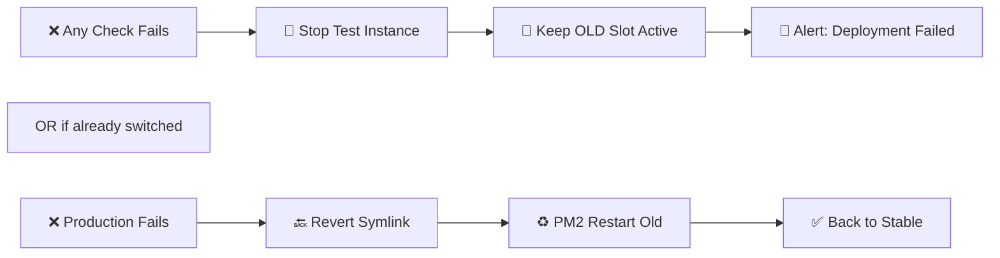

# 🚀 SSH Deployment Flow - Banking Application

## Blue-Green Deployment Strategy

```mermaid
graph TD
    Start([🚀 Deployment Triggered]) --> Check{SSH Connection<br/>to 45.83.42.74?}
    
    Check -->|❌ Failed| Abort[⛔ Abort Deployment<br/>Connection Error]
    Check -->|✅ Success| Detect[📍 Detect Current Slot]
    
    Detect --> Current{Current Slot?}
    Current -->|Blue Active| Green[🟢 Deploy to GREEN]
    Current -->|Green Active| Blue[🔵 Deploy to BLUE]
    Current -->|Not Found| InitBlue[🔵 Initialize BLUE<br/>as first deployment]
    
    Green --> Rsync1[📤 Rsync Files to GREEN<br/>excluding node_modules]
    Blue --> Rsync2[📤 Rsync Files to BLUE<br/>excluding node_modules]
    InitBlue --> Rsync2
    
    Rsync1 --> Install1[📦 npm ci --production<br/>in GREEN slot]
    Rsync2 --> Install2[📦 npm ci --production<br/>in BLUE slot]
    
    Install1 --> Build1[🔨 Build Frontend<br/>npm run build in mainapp/]
    Install2 --> Build2[🔨 Build Frontend<br/>npm run build in mainapp/]
    
    Build1 --> TestStart1[🧪 Start Test Instance<br/>PORT=8004]
    Build2 --> TestStart2[🧪 Start Test Instance<br/>PORT=8004]
    
    TestStart1 --> HealthCheck[🏥 Health Checks]
    TestStart2 --> HealthCheck
    
    HealthCheck --> HC1{/api/health<br/>returns 200?}
    HC1 -->|❌| Rollback[⚠️ ROLLBACK]
    HC1 -->|✅| HC2{Dropdowns API<br/>has data?}
    
    HC2 -->|❌| Rollback
    HC2 -->|✅| HC3{LTV Ratios<br/>Correct?}
    
    HC3 -->|❌| Rollback
    HC3 -->|✅| HC4{Database<br/>Connected?}
    
    HC4 -->|❌| Rollback
    HC4 -->|✅| Switch[🔄 Switch Traffic]
    
    Switch --> UpdateSymlink[🔗 Update Symlink<br/>current → new slot]
    UpdateSymlink --> PM2Restart[♻️ PM2 Restart<br/>bankim-api]
    
    PM2Restart --> FinalCheck{Final<br/>Validation}
    FinalCheck -->|✅| Success[✅ Deployment Complete!<br/>Old slot becomes backup]
    FinalCheck -->|❌| Rollback
    
    Rollback --> RevertSymlink[🔙 Revert Symlink<br/>current → old slot]
    RevertSymlink --> PM2Revert[♻️ PM2 Restart<br/>with old code]
    PM2Revert --> Failed[❌ Deployment Failed<br/>Rolled back to previous]

    style Start fill:#e1f5fe
    style Success fill:#c8e6c9
    style Failed fill:#ffcdd2
    style Rollback fill:#fff3e0
    style Switch fill:#f3e5f5
```



## Deployment Slots Architecture

```
/var/www/bankim/
├── blue/                 # Blue deployment slot
│   ├── server/
│   │   └── server-db.js
│   ├── mainapp/
│   │   └── build/       # Built frontend
│   ├── node_modules/
│   └── .env
├── green/                # Green deployment slot
│   ├── server/
│   │   └── server-db.js
│   ├── mainapp/
│   │   └── build/       # Built frontend
│   ├── node_modules/
│   └── .env
├── current → blue        # Symlink to active slot
└── shared/               # Shared resources
    ├── .env.production
    ├── uploads/
    └── logs/
```

## Step-by-Step Process

### 1️⃣ **Pre-Deployment Phase**
```bash
┌─────────────────────────────────────┐
│  🔍 Check SSH Connection            │
│  ssh root@45.83.42.74 "echo OK"     │
└─────────────────────────────────────┘
                ↓
┌─────────────────────────────────────┐
│  📍 Detect Current Active Slot      │
│  readlink /var/www/bankim/current   │
│  Returns: "blue" or "green"         │
└─────────────────────────────────────┘
```

### 2️⃣ **Deployment Phase**
```bash
┌─────────────────────────────────────┐
│  📤 Sync Files to Inactive Slot     │
│  rsync -avz ./ → GREEN (if BLUE)    │
│  Excludes: node_modules, .git       │
└─────────────────────────────────────┘
                ↓
┌─────────────────────────────────────┐
│  📦 Install Dependencies            │
│  npm ci --production                │
│  cd mainapp && npm ci && npm build  │
└─────────────────────────────────────┘
```

### 3️⃣ **Testing Phase**
```bash
┌─────────────────────────────────────┐
│  🧪 Start Test Instance on :8004    │
│  PORT=8004 node server-db.js &      │
└─────────────────────────────────────┘
                ↓
┌─────────────────────────────────────────────┐
│  🏥 Health Checks (All Must Pass)          │
├─────────────────────────────────────────────┤
│  ✓ GET /api/health → 200 OK                │
│  ✓ GET /api/v1/dropdowns → has data        │
│  ✓ LTV: no_property=75%, has=50%, sell=70% │
│  ✓ Database connections active             │
└─────────────────────────────────────────────┘
```

### 4️⃣ **Switch Phase**
```bash
┌─────────────────────────────────────┐
│  🔄 Switch Traffic to New Slot      │
│  ln -sfn /var/www/bankim/GREEN      │
│         /var/www/bankim/current     │
└─────────────────────────────────────┘
                ↓
┌─────────────────────────────────────┐
│  ♻️ Restart PM2 Process             │
│  pm2 restart bankim-api             │
└─────────────────────────────────────┘
```

### 5️⃣ **Validation Phase**
```bash
┌─────────────────────────────────────┐
│  ✅ Final Production Checks         │
│  curl http://45.83.42.74:8003/...   │
│  pm2 status bankim-api              │
└─────────────────────────────────────┘
```

## Rollback Flow



## Timeline Example

```
Time    Action                          Active Slot    Status
──────────────────────────────────────────────────────────────
00:00   Start Deployment               BLUE           🟢 Live
00:01   SSH Connect & Check            BLUE           🟢 Live
00:02   Deploy to GREEN slot           BLUE           🟢 Live
00:05   Install dependencies (GREEN)   BLUE           🟢 Live
00:08   Build frontend (GREEN)         BLUE           🟢 Live
00:10   Start test on :8004 (GREEN)    BLUE           🟢 Live
00:11   Run health checks (GREEN)      BLUE           🟢 Live
00:12   All checks pass ✅             BLUE           🟢 Live
00:13   Switch symlink to GREEN        GREEN          🔄 Switching
00:14   PM2 restart with GREEN         GREEN          🟢 Live
00:15   Final validation               GREEN          🟢 Live
00:16   Deployment complete!           GREEN          🟢 Live
        (BLUE is now backup)
```

## Critical Validation Points

### 🏦 Banking-Specific Checks

1. **Dropdown Data Integrity**
   ```json
   {
     "property_ownership": [
       {"value": "no_property", "label": "I don't own any property"},
       {"value": "has_property", "label": "I own a property"},
       {"value": "selling_property", "label": "I'm selling a property"}
     ]
   }
   ```

2. **LTV Ratio Validation**
   ```
   no_property    → 75% max financing
   has_property   → 50% max financing  
   selling_property → 70% max financing
   ```

3. **Database Connections**
   - Maglev (Main DB): `postgresql://...@maglev.proxy.rlwy.net`
   - Shortline (Content): `postgresql://...@shortline.proxy.rlwy.net`

## Zero-Downtime Guarantee

```
┌──────────────────────────────────────────────┐
│  Current State: BLUE serving traffic         │
│  ├── Users connected: 1,234                  │
│  ├── Active sessions: 567                    │
│  └── Status: Healthy                         │
├──────────────────────────────────────────────┤
│  Background: Deploy & test GREEN             │
│  ├── No user impact                          │
│  ├── Full validation before switch           │
│  └── Instant rollback capability             │
├──────────────────────────────────────────────┤
│  Switch: Atomic symlink update               │
│  ├── Takes < 1 second                        │
│  ├── PM2 graceful reload                     │
│  └── Zero dropped connections                │
└──────────────────────────────────────────────┘
```

## Commands Summary

```bash
# Deploy
./deploy.sh

# Check status
ssh root@45.83.42.74 "pm2 status"

# View logs
ssh root@45.83.42.74 "pm2 logs bankim-api"

# Emergency rollback
ssh root@45.83.42.74 "./rollback.sh"
```