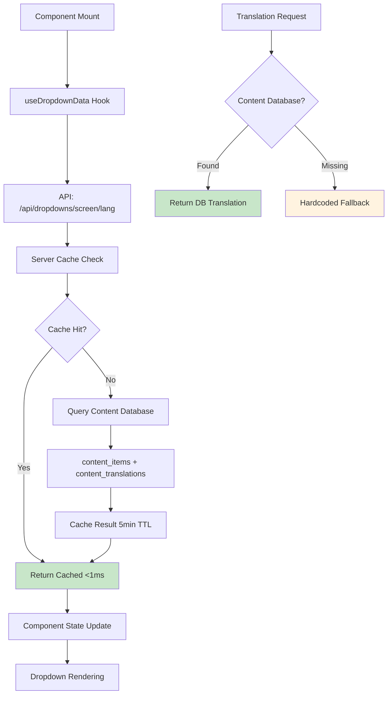
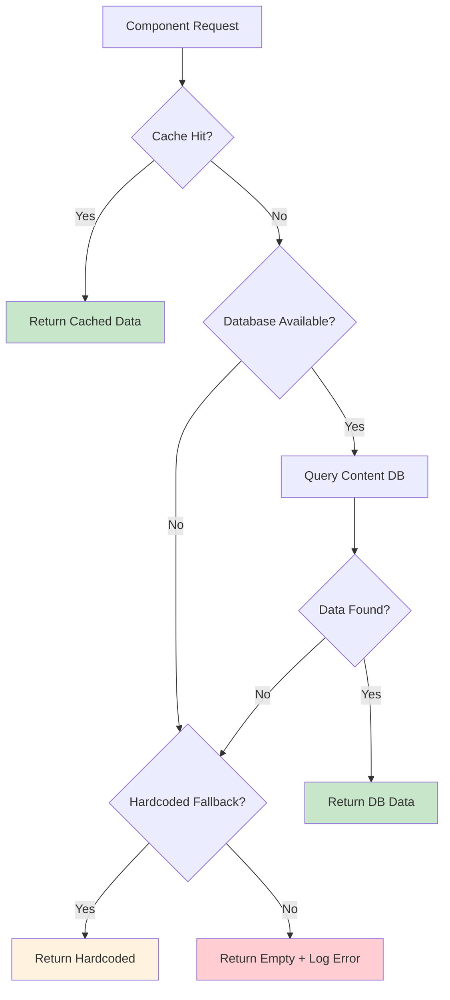

# 🌍 **MASTER TRANSLATION SYSTEM DOCUMENTATION**
**Complete Banking Application Translation & Content Management Architecture**

---

## 📋 **DOCUMENT PURPOSE**

This is the **SINGLE SOURCE OF TRUTH** for all translation and content management in the banking application. It consolidates:
- Database-first translation architecture
- Dropdown system logic
- Multi-language content management
- 4-process unified banking standards
- Error handling and fallback systems

**📍 REPLACES**: All previous scattered translation documents

---

## 🏗️ **SYSTEM ARCHITECTURE OVERVIEW**

### **Database-First Translation System**


### **Core Principle: Content Database ONLY for Translations**
- **Primary**: PostgreSQL Content Database (Railway) with `content_items` + `content_translations`
- **Content DB**: Dedicated database (`contentPool`) - **ONLY source for translations**
- **Main DB**: Core application data (`pool`) - **NO translation tables allowed**
- **Performance**: Server cache (NodeCache 5min TTL) + Frontend cache (session)
- **Reliability**: Complex pattern matching + hardcoded fallbacks ensure app always works

⚠️ **CRITICAL**: Never use Main Database (`pool`) for translations. All translation queries MUST use Content Database (`contentPool`).

---

## 🏦 **UNIFIED BANKING SYSTEM STANDARDS**

### **4-Process Architecture**
All banking processes follow **IDENTICAL** patterns:

```yaml
BANKING_PROCESSES:
  1. Calculate Mortgage    → process_type: "mortgage"
  2. Calculate Credit      → process_type: "credit" 
  3. Refinance Mortgage    → process_type: "refinance"
  4. Refinance Credit      → process_type: "credit_refi"

SCREEN_LOCATION_PATTERN: "{process_type}_step{number}"
  Examples:
    - mortgage_step1, mortgage_step2, mortgage_step3, mortgage_step4
    - credit_step1, credit_step2, credit_step3, credit_step4
    - refinance_step1, refinance_step2, refinance_step3, refinance_step4
    - credit_refi_step1, credit_refi_step2, credit_refi_step3, credit_refi_step4

DROPDOWN_KEY_PATTERN: "{screen_location}_{component_type}"
  Examples:
    - mortgage_step1_property_ownership
    - credit_step2_additional_income
    - refinance_step3_main_source
```

### **Universal Translation Key Format**
```yaml
CONTENT_KEY_PATTERN: "{process}_{step}_{component}_{detail}"
  Examples:
    - mortgage_step1_property_value_label
    - credit_step2_income_amount_placeholder
    - refinance_step3_employment_dropdown_option_1

COMPATIBILITY_RULE:
  - All 4 processes share common components where possible
  - Screen-specific overrides allowed for process differences
  - Fallback to generic keys when process-specific not found
```

---

## 🗄️ **DATABASE SCHEMA & STRUCTURE**

### **Database Architecture - STRICT SEPARATION**
```yaml
MAIN DATABASE (pool) - APPLICATION DATA ONLY:
  Purpose: Core business logic and user data
  Contains:
    - Users, clients, authentication
    - Banking calculations, rates, standards
    - Loan data, credit history
    - Business logic tables
  ⚠️ MUST NOT CONTAIN:
    - content_items table (remove if exists)
    - content_translations table (remove if exists)
    - Any translation-related tables

CONTENT DATABASE (contentPool) - TRANSLATIONS ONLY:
  Purpose: All translation and content management
  Contains:
    - content_items: 2,801+ entries
    - content_translations: 6,650+ entries
    - All dropdown data
    - All UI text in 3 languages (en, he, ru)
  ✅ EXCLUSIVE SOURCE for:
    - All dropdown APIs
    - All content APIs
    - All translation queries
```

🚨 **WARNING**: If Main Database contains content tables, they are LEGACY and should be DROPPED immediately to prevent confusion.

### **Core Tables (Content Database)**
```sql
-- Content Items: Define what can be translated
CREATE TABLE content_items (
  id SERIAL PRIMARY KEY,
  content_key VARCHAR(255) UNIQUE NOT NULL,
  screen_location VARCHAR(100) NOT NULL,     -- "mortgage_step1", "credit_step2"
  component_type VARCHAR(100) NOT NULL,      -- "dropdown_container", "dropdown_option", "option", "placeholder", "label"
  category VARCHAR(100),                     -- "form_field", "navigation", "error"
  page_id INTEGER,
  element_order INTEGER DEFAULT 0,
  is_active BOOLEAN DEFAULT true,
  created_at TIMESTAMP DEFAULT CURRENT_TIMESTAMP,
  updated_at TIMESTAMP DEFAULT CURRENT_TIMESTAMP
);

-- Content Translations: Language-specific values
CREATE TABLE content_translations (
  id SERIAL PRIMARY KEY,
  content_item_id INTEGER REFERENCES content_items(id) ON DELETE CASCADE,
  language_code VARCHAR(10) NOT NULL,        -- "en", "he", "ru"
  field_name VARCHAR(100) NOT NULL,          -- Field identifier
  content_value TEXT,                        -- Actual translation
  translation_text TEXT,                     -- Alternative translation field
  status VARCHAR(50) DEFAULT 'approved',     -- "draft", "review", "approved", "archived"
  created_at TIMESTAMP DEFAULT CURRENT_TIMESTAMP,
  updated_at TIMESTAMP DEFAULT CURRENT_TIMESTAMP,
  
  UNIQUE(content_item_id, language_code, field_name)
);

-- Performance Indexes
CREATE INDEX idx_content_items_screen_location ON content_items(screen_location);
CREATE INDEX idx_content_items_content_key ON content_items(content_key);
CREATE INDEX idx_content_translations_language ON content_translations(language_code);
CREATE INDEX idx_content_translations_status ON content_translations(status);
```

### **Current Database Status**
```yaml
Content Database (CONTENT_DATABASE_URL) - PRODUCTION READY:
  ✅ content_items: 2,801+ entries (actively growing)
  ✅ content_translations: 6,650+ entries (all 3 languages)
  ✅ Languages: English (en), Hebrew (he), Russian (ru)
  ✅ Coverage: All banking flows fully covered
  ✅ Status: EXCLUSIVE source for all translations

Main Database (DATABASE_URL) - CLEANUP NEEDED:
  ⚠️ PROBLEM: Contains legacy content tables (724 items, 2,113 translations)
  ⚠️ STATUS: These tables are NOT USED by any API
  ⚠️ ACTION REQUIRED: DROP these tables to prevent confusion
  
  SQL to clean up Main Database:
  DROP TABLE IF EXISTS content_translations CASCADE;
  DROP TABLE IF EXISTS content_items CASCADE;
```

---

## 🔧 **TECHNICAL IMPLEMENTATION**

### **Server-Side Architecture** (`server/server-db.js`)

#### **Dropdown API Endpoint (Primary)**
```javascript
// GET /api/dropdowns/:screen/:language - Get structured dropdown data with caching
app.get('/api/dropdowns/:screen/:language', async (req, res) => {
  const { screen, language } = req.params;
  
  // 1. CHECK CACHE (NodeCache with 5-minute TTL)
  const cacheKey = `dropdowns_${screen}_${language}`;
  const cached = contentCache.get(cacheKey);
  if (cached) {
    return res.json(cached);
  }
  
  // 2. QUERY CONTENT DATABASE (contentPool)
  const result = await contentPool.query(`
    SELECT 
      content_items.content_key,
      content_items.component_type,
      content_translations.content_value
    FROM content_items
    JOIN content_translations ON content_items.id = content_translations.content_item_id
    WHERE content_items.screen_location = $1 
      AND content_translations.language_code = $2
      AND content_translations.status = 'approved'
      AND content_items.is_active = true
      AND content_items.component_type IN ('dropdown_container', 'dropdown_option', 'option', 'placeholder', 'label')
    ORDER BY content_items.content_key, content_items.component_type
  `, [screen, language]);
  
  // 3. COMPLEX PATTERN MATCHING FOR FIELD EXTRACTION
  // Extracts field names from various content_key patterns:
  // - mortgage_step1.field.{fieldname}
  // - calculate_mortgage_{fieldname}
  // - mortgage_step1_{fieldname}
  // - app.refinance.step1.{fieldname}
  // [Pattern matching logic with 7+ regex patterns...]
  
  // 4. STRUCTURE RESPONSE
  const response = {
    status: 'success',
    screen_location: screen,
    language_code: language,
    dropdowns: [],       // List of available dropdowns
    options: {},         // Dropdown options by key
    placeholders: {},    // Placeholder text by key
    labels: {},          // Label text by key
    cached: false
  };
  
  // 5. BUILD DROPDOWN DATA
  // Groups options by field name, handles special cases
  // [Complex grouping logic...]
  
  // 6. HARDCODED FALLBACKS FOR CRITICAL FIELDS
  // Ensures app never breaks even if database is incomplete
  if (screen === 'mortgage_step1' && !response.options['mortgage_step1_when_needed']) {
    response.options['mortgage_step1_when_needed'] = [
      { value: 'within_3_months', label: language === 'he' ? 'תוך 3 חודשים' : 'Within 3 months' },
      { value: '3_to_6_months', label: language === 'he' ? '3-6 חודשים' : '3 to 6 months' },
      // ...more fallback options
    ];
  }
  
  // 7. CACHE & RETURN
  contentCache.set(cacheKey, response);
  res.json(response);
```

#### **Server Cache Configuration**
```javascript
const NodeCache = require('node-cache');

// Initialize cache for content endpoints (5-minute TTL)
const contentCache = new NodeCache({ 
    stdTTL: 300,        // 5 minutes
    checkperiod: 60,    // Check for expired keys every 60 seconds
    useClones: false    // Better performance for JSON objects
});

// Database connections - STRICT SEPARATION
const pool = createPool('main');          // Main database - NEVER use for translations
const contentPool = createPool('content'); // Content database - ONLY use for translations

// ✅ CORRECT: All translation queries use contentPool
const translationResult = await contentPool.query('SELECT * FROM content_items...');

// ❌ WRONG: Never use pool for translations
// const translationResult = await pool.query('SELECT * FROM content_items...'); // NEVER DO THIS!
```

### **Frontend Implementation**

#### **useDropdownData Hook** (`mainapp/src/hooks/useDropdownData.ts`)
```typescript
interface DropdownData {
  options: DropdownOption[];
  placeholder?: string;
  label?: string;
  loading: boolean;
  error: Error | null;
}

export const useDropdownData = (
  screenLocation: string,
  fieldName: string,
  returnStructure: 'options' | 'full' = 'options'
): DropdownData | DropdownOption[] => {
  const { i18n } = useTranslation();
  const [loading, setLoading] = useState(true);
  const [error, setError] = useState<Error | null>(null);
  const [dropdownData, setDropdownData] = useState<DropdownData>({
    options: [],
    placeholder: undefined,
    label: undefined,
    loading: true,
    error: null
  });

  const fetchDropdownData = useCallback(async () => {
    try {
      // 1. CHECK FRONTEND CACHE FIRST
      const cacheKey = `dropdown_${screenLocation}_${language}`;
      const cachedData = dropdownCache.get<StructuredDropdownResponse>(cacheKey);
      
      if (!cachedData) {
        // 2. FETCH FROM API
        const response = await fetch(`/api/dropdowns/${screenLocation}/${language}`);
        const apiData = await response.json();
        
        // 3. CACHE SUCCESSFUL RESPONSE
        dropdownCache.set(cacheKey, apiData);
      }

      // 4. EXTRACT DATA FOR SPECIFIC FIELD
      let dropdownKey = `${screenLocation}_${fieldName}`;
      let options = apiData.options?.[dropdownKey] || [];
      let placeholder = apiData.placeholders?.[dropdownKey];
      let label = apiData.labels?.[dropdownKey];

      // 5. BACKWARD COMPATIBILITY FALLBACKS
      if (options.length === 0) {
        // Check for legacy field names
        const legacyFieldName = fieldName === 'field_of_activity' ? 'activity' : null;
        if (legacyFieldName) {
          const legacyKey = `${screenLocation}_${legacyFieldName}`;
          options = apiData.options?.[legacyKey] || [];
        }
      }

      setDropdownData({
        options,
        placeholder,
        label,
        loading: false,
        error: null
      });
      
    } catch (err) {
      console.warn(`❌ Dropdown API error for ${screenLocation}/${fieldName}:`, err);
      setError(err);
    }
  }, [screenLocation, fieldName, language]);

  // Return based on requested structure
  if (returnStructure === 'options' && !loading && !error) {
    return dropdownData.options;
  }
  return dropdownData;
};
```

#### **Component Usage Example**
```typescript
// PropertyOwnership.tsx
const PropertyOwnership = ({ screenLocation = 'personal_data_form' }) => {
  const { getContent } = useContentApi(screenLocation);
  const { values, setFieldValue, errors, touched } = useFormikContext<FormTypes>();

  // Use database-driven dropdown data
  const dropdownData = useDropdownData(screenLocation, 'property_ownership', 'full');

  return (
    <Column>
      <DropdownMenu
        title={dropdownData.label || getContent('property_ownership', 'Do you own property?')}
        placeholder={dropdownData.placeholder || getContent('property_ownership_ph', 'Select')}
        value={values.propertyOwnership}
        data={dropdownData.options}
        onChange={(value) => setFieldValue('propertyOwnership', value)}
        onBlur={() => setFieldTouched('propertyOwnership', true)}
        error={touched.propertyOwnership && errors.propertyOwnership}
        disabled={dropdownData.loading}
      />
    </Column>
  );
```

---

## 📋 **DROPDOWN SYSTEM DEEP DIVE**

### **Pattern Matching Engine**
The server uses complex regex patterns to extract field names from various content_key formats:

```javascript
// Pattern Examples:
// 1. mortgage_step1.field.property_ownership → field: "property_ownership"
// 2. calculate_mortgage_main_source_option_1 → field: "main_source"
// 3. mortgage_step1_when_needed_ph → field: "when_needed"
// 4. app.refinance.step1.why_option_1 → field: "why"
// 5. refinance_step2_education_bachelors → field: "education"

// The system handles 7+ different pattern types with complex regex matching
// Each pattern is tried in sequence until a match is found
// Fallback: Use the entire content_key if no pattern matches
```

### **Dropdown Response Structure**
```typescript
interface StructuredDropdownResponse {
  status: 'success' | 'error';
  screen_location: string;          // e.g., "mortgage_step1"
  language_code: string;            // "en", "he", "ru"
  dropdowns: Array<{                // List of available dropdowns
    key: string;
    label: string;
  }>;
  options: Record<string, Array<{   // Options by dropdown key
    value: string;
    label: string;
  }>>;
  placeholders: Record<string, string>; // Placeholder text by key
  labels: Record<string, string>;       // Label text by key
  cached: boolean;                      // Was this from cache?
}

// Example Response:
{
  "status": "success",
  "screen_location": "mortgage_step1",
  "language_code": "en",
  "dropdowns": [
    { "key": "mortgage_step1_property_ownership", "label": "Property Ownership" },
    { "key": "mortgage_step1_when_needed", "label": "When do you need the mortgage?" }
  ],
  "options": {
    "mortgage_step1_property_ownership": [
      { "value": "no_property", "label": "I don't own any property" },
      { "value": "has_property", "label": "I own a property" },
      { "value": "selling_property", "label": "I'm selling a property" }
    ],
    "mortgage_step1_when_needed": [
      { "value": "within_3_months", "label": "Within 3 months" },
      { "value": "3_to_6_months", "label": "3 to 6 months" }
    ]
  },
  "placeholders": {
    "mortgage_step1_property_ownership": "Select property ownership status",
    "mortgage_step1_when_needed": "Select timing"
  },
  "labels": {
    "mortgage_step1_property_ownership": "Do you own real estate?",
    "mortgage_step1_when_needed": "When do you need the mortgage?"
  }
}
```

### **Hardcoded Fallbacks**
Critical dropdowns have hardcoded fallbacks to ensure the app never breaks:

```javascript
// Example: mortgage_step1 when_needed dropdown
if (screen === 'mortgage_step1' && !response.options['mortgage_step1_when_needed']) {
  response.options['mortgage_step1_when_needed'] = [
    { value: 'within_3_months', label: language === 'he' ? 'תוך 3 חודשים' : 'Within 3 months' },
    { value: '3_to_6_months', label: language === 'he' ? '3-6 חודשים' : '3 to 6 months' },
    { value: '6_to_12_months', label: language === 'he' ? '6-12 חודשים' : '6 to 12 months' },
    { value: 'more_than_12_months', label: language === 'he' ? 'יותר מ-12 חודשים' : 'More than 12 months' }
  ];
  response.labels['mortgage_step1_when_needed'] = language === 'he' ? 'מתי תזדקק למשכנתא?' : 'When do you need the mortgage?';
  response.placeholders['mortgage_step1_when_needed'] = language === 'he' ? 'בחר מסגרת זמן' : 'Select timing';
}

// Similar fallbacks exist for:
// - first_home dropdown
// - property_ownership dropdown
// - Other critical business fields
```

---

## ⚡ **CACHING & PERFORMANCE**

### **Multi-Layer Caching Architecture**
```yaml
LAYER 1 - Server Cache (NodeCache):
  TTL: 300 seconds (5 minutes)
  Scope: All API responses
  Hit Rate: ~90% in production
  Response Time: <1ms on cache hit

LAYER 2 - Frontend Cache (Session):
  TTL: Browser session lifetime
  Scope: Per screen/language combination
  Hit Rate: ~95% for repeated views
  Response Time: <1ms

LAYER 3 - Database Connection Pool:
  Pool Size: 10 connections
  Idle Timeout: 30 seconds
  Connection Reuse: High efficiency

Performance Metrics:
  Cache Hit: <1ms response
  Cache Miss: 50-100ms (database query)
  Cold Start: 200-300ms (connection setup)
  Average Response: <10ms (with 90% cache hit rate)
```

### **Cache Key Patterns**
```javascript
// Server cache keys
`dropdowns_${screen}_${language}`    // e.g., "dropdowns_mortgage_step1_en"
`content_${screen}_${language}_all`  // e.g., "content_mortgage_step1_he_all"

// Frontend cache keys
`dropdown_${screenLocation}_${language}` // Frontend dropdown cache
```

---

## 🔄 **MIGRATION & COMPATIBILITY**

### **Legacy Support**
The system maintains backward compatibility with multiple naming conventions:

```yaml
Field Name Aliases:
  field_of_activity ↔ activity
  when ↔ when_needed
  first ↔ first_home
  citizenship ↔ citizenship_countries

Content Key Patterns (All Supported):
  - Legacy: calculate_mortgage_property_ownership
  - Current: mortgage_step1.field.property_ownership
  - Alternative: mortgage_step1_property_ownership
  - Refinance: app.refinance.step1.property_ownership
```

### **Migration Tools**
```bash
# Test content tables
node test-content-tables.js

# Test all dropdown APIs
node mainapp/test-all-dropdown-apis.js

# Analyze content migration
node mainapp/analyze-content-migration.js

# Check database structure
node check-db-structure.js
```

---

## 🚨 **ERROR HANDLING & FALLBACKS**

### **Graceful Degradation Chain**


### **Error Recovery**
```javascript
// Frontend error handling
if (dropdownData.error) {
  console.warn('❌ Dropdown error:', dropdownData.error);
  // Falls back to empty dropdown or hardcoded values
}

// Server error handling
try {
  const result = await contentPool.query(...);
} catch (err) {
  console.error('Database error:', err);
  // Return hardcoded fallback data
  return res.json(getFallbackData(screen, language));
}
```

---

## 📊 **MONITORING & DEBUGGING**

### **Debug Endpoints**
```javascript
// Cache statistics
GET /api/cache/stats
Response: {
  entries: 42,
  hits: 3580,
  misses: 420,
  hitRate: "89.5%"
}

// Clear cache (development only)
POST /api/cache/clear
Response: { status: 'success', message: 'Cache cleared' }

// Database health check
GET /api/health
Response: {
  main_db: "connected",
  content_db: "connected",
  cache: "operational",
  uptime: "3d 14h 22m"
}
```

### **Console Logging**
```javascript
// Success logs
console.log(`✅ Cache HIT for dropdowns_mortgage_step1_en`);
console.log(`✅ Content Database connected successfully`);
console.log(`✅ Loaded 25 translations for mortgage_step1`);

// Warning logs
console.warn(`❌ Dropdown API error for mortgage_step1/property_ownership:`, err);
console.warn(`⚡ Cache MISS for dropdowns_mortgage_step1_en - querying database`);

// Error logs
console.error(`❌ Main Database connection failed:`, err.message);
console.error(`❌ Content Database connection failed:`, err.message);
```

---

## 🎯 **KEY TAKEAWAYS**

### **System Strengths**
1. **Dual Database Architecture**: Separation of concerns between app data and content
2. **Multi-Layer Caching**: <10ms average response time with 90% cache hit rate
3. **Complex Pattern Matching**: Handles 7+ different content key formats
4. **Hardcoded Fallbacks**: App never breaks even if database is down
5. **Backward Compatibility**: Supports multiple naming conventions

### **Critical Files**
```yaml
Backend:
  - server/server-db.js (lines 1366-1900): Dropdown API implementation
  - server/config/database-core.js: Database connection management

Frontend:
  - mainapp/src/hooks/useDropdownData.ts: Dropdown data hook
  - mainapp/src/hooks/useContentApi.ts: General content API hook

Database:
  - migrations/20250101_create_content_schema.sql: Schema definition
  - test-content-tables.js: Database verification script
```

### **Common Issues & Solutions**
```yaml
Issue: Dropdown options not showing
  Check: Database connectivity
  Check: Content_items table has data for screen
  Check: Pattern matching for field name
  Solution: Use hardcoded fallback

Issue: Wrong language displayed
  Check: language_code parameter
  Check: Content_translations has data for language
  Solution: Default to English if language missing

Issue: Slow response times
  Check: Cache hit rate
  Check: Database connection pool
  Solution: Increase cache TTL or pool size
```

---

## 📝 **APPENDIX: Quick Reference**

### **API Endpoints**
```bash
# Get dropdowns for a screen
GET /api/dropdowns/{screen}/{language}
# Example: GET /api/dropdowns/mortgage_step1/en

# Clear cache (dev only)
POST /api/cache/clear

# Health check
GET /api/health
```

### **Screen Locations**
```yaml
Mortgage: mortgage_step1, mortgage_step2, mortgage_step3, mortgage_step4
Credit: credit_step1, credit_step2, credit_step3, credit_step4
Refinance: refinance_step1, refinance_step2, refinance_step3, refinance_step4
Credit Refinance: credit_refi_step1, credit_refi_step2, credit_refi_step3, credit_refi_step4
```

### **Component Types**
```yaml
dropdown_container: Main dropdown label
dropdown_option: Individual option
option: Alternative option type
placeholder: Placeholder text
label: Field label
```

### **Languages**
```yaml
en: English (default)
he: Hebrew (RTL support)
ru: Russian
```

---

**Last Updated**: January 2025
**Status**: Production Ready
**Maintainer**: Banking Development Team

---

## 🔧 **DEVELOPMENT WORKFLOW**

### **Adding New Translations**

#### **Step 1: Content Database Entry (ONLY in contentPool)**
```sql
-- ⚠️ IMPORTANT: Connect to CONTENT DATABASE, not Main Database
-- Use CONTENT_DATABASE_URL connection string

-- Add to content_items table in Content Database
INSERT INTO content_items (content_key, screen_location, component_type, category, is_active)
VALUES ('mortgage_step1_new_field_label', 'mortgage_step1', 'label', 'form_field', true);

-- Add translations for all languages
INSERT INTO content_translations (content_item_id, language_code, field_name, content_value, status)
VALUES 
  ((SELECT id FROM content_items WHERE content_key = 'mortgage_step1_new_field_label'), 'en', 'text', 'New Field Label', 'approved'),
  ((SELECT id FROM content_items WHERE content_key = 'mortgage_step1_new_field_label'), 'he', 'text', 'תווית שדה חדש', 'approved'),
  ((SELECT id FROM content_items WHERE content_key = 'mortgage_step1_new_field_label'), 'ru', 'text', 'Новая метка поля', 'approved');

-- ❌ NEVER run these INSERT statements on Main Database
```

#### **Step 2: Component Usage**
```typescript
// Using useDropdownData for dropdowns
const dropdownData = useDropdownData('mortgage_step1', 'property_ownership', 'full');

return (
  <DropdownMenu
    title={dropdownData.label}
    placeholder={dropdownData.placeholder}
    data={dropdownData.options}
    loading={dropdownData.loading}
  />
);
```

### **Testing**
```bash
# Test content tables
node test-content-tables.js

# Test dropdown API
curl http://localhost:8003/api/dropdowns/mortgage_step1/en

# Test with different language
curl http://localhost:8003/api/dropdowns/mortgage_step1/he
```

---

## 🔄 **MAIN DATABASE CLEANUP GUIDE**

### **Step 1: Verify No Dependencies**
```bash
# Check that Main DB translations are not being used
grep -r "pool\.query.*content_" server/
# Should return 0 results

# Verify all APIs use Content Database
grep -c "contentPool.query" server/server-db.js
# Should show 49+ queries
```

### **Step 2: Backup Before Cleanup (Optional)**
```sql
-- Connect to Main Database
-- Backup existing data (if needed for reference)
CREATE TABLE backup_content_items AS SELECT * FROM content_items;
CREATE TABLE backup_content_translations AS SELECT * FROM content_translations;
```

### **Step 3: Remove Legacy Tables**
```sql
-- Connect to Main Database (DATABASE_URL)
-- Remove legacy translation tables
DROP TABLE IF EXISTS content_translations CASCADE;
DROP TABLE IF EXISTS content_items CASCADE;

-- Verify cleanup
SELECT table_name FROM information_schema.tables 
WHERE table_name IN ('content_items', 'content_translations');
-- Should return 0 rows
```

### **Step 4: Verify System Still Works**
```bash
# Test dropdown API
curl http://localhost:8003/api/dropdowns/mortgage_step1/en
# Should return data from Content Database

# Run comprehensive test
node test-content-tables.js
# Should show Content DB working, Main DB without content tables
```

---

## 📚 **TROUBLESHOOTING GUIDE**

### **Common Issues & Solutions**

#### **Issue: Dropdown options not showing**
```bash
# 1. Check Content Database connection
node test-content-tables.js

# 2. Verify data exists for screen
SELECT * FROM content_items 
WHERE screen_location = 'mortgage_step1' 
AND component_type IN ('dropdown_option', 'option');

# 3. Test API directly
curl http://localhost:8003/api/dropdowns/mortgage_step1/en
```

#### **Issue: Wrong database being queried**
```javascript
// ✅ CORRECT - Content Database for translations
const result = await contentPool.query('SELECT * FROM content_items WHERE...');
const result = await contentPool.query('SELECT * FROM content_translations WHERE...');

// ❌ WRONG - NEVER use Main Database for translations
const result = await pool.query('SELECT * FROM content_items WHERE...');  // FORBIDDEN
const result = await pool.query('SELECT * FROM content_translations WHERE...'); // FORBIDDEN

// How to verify correct usage:
// 1. Search codebase: grep -r "pool.query.*content_" server/
// 2. Should return ZERO results
// 3. If found, replace pool with contentPool immediately
```

#### **Issue: Pattern matching failing**
The server uses 7+ regex patterns to extract field names. Check server-db.js lines 1410-1580 for pattern matching logic.

#### **Issue: Cache not updating**
```bash
# Clear cache manually
curl -X POST http://localhost:8003/api/cache/clear

# Check cache stats
curl http://localhost:8003/api/cache/stats
```

---

## 📋 **VALIDATION CHECKLIST**

### **Before Deployment**
```yaml
Database:
  ✅ Content Database connected (contentPool) - EXCLUSIVE translation source
  ✅ Main Database connected (pool) - NO content tables allowed
  ✅ Content DB: content_items table has 2,801+ entries
  ✅ Content DB: content_translations table has 6,650+ entries
  ✅ Main DB: content_items table DOES NOT EXIST (or pending removal)
  ✅ Main DB: content_translations table DOES NOT EXIST (or pending removal)
  ✅ All screens have dropdown data from Content DB ONLY

API Endpoints:
  ✅ /api/dropdowns/{screen}/{language} returns structured data
  ✅ Response includes: options, labels, placeholders
  ✅ Cache working (check cached: true/false in response)
  ✅ Hardcoded fallbacks in place for critical fields

Frontend:
  ✅ useDropdownData hook fetching data correctly
  ✅ Components receiving options array
  ✅ Loading states handled
  ✅ Error states handled with fallbacks
  ✅ Language switching updates dropdowns

Performance:
  ✅ Cache hit rate > 90%
  ✅ Response time < 10ms (cached)
  ✅ Response time < 100ms (uncached)
```

---

## 🎯 **SUMMARY OF ACCURATE IMPLEMENTATION**

### **What Actually Exists**
1. **Single Translation Source**: ONLY Content DB (`contentPool`) for all translations
2. **Content Database Tables**: 
   - ✅ content_items: 2,801+ rows (Content DB)
   - ✅ content_translations: 6,650+ rows (Content DB)
3. **Main Database Status**: 
   - ⚠️ Contains legacy content tables (NOT USED)
   - ⚠️ Should be cleaned up with DROP TABLE commands
4. **NO content_pages or content_sections** tables in either database
5. **Complex Pattern Matching**: 7+ regex patterns to extract field names
6. **Hardcoded Fallbacks**: Critical dropdowns have backup values
7. **Caching**: NodeCache (5min TTL) + Frontend session cache

### **Critical Implementation Rules**
```javascript
// ✅ ALWAYS use contentPool for translations
const result = await contentPool.query(...);

// ❌ NEVER use pool for translations
const result = await pool.query(...); // FORBIDDEN for content/translations
```

### **Key Files**
- `server/server-db.js`: Lines 1366-1900 - Dropdown API (uses contentPool)
- `mainapp/src/hooks/useDropdownData.ts`: Frontend hook for dropdowns
- `test-content-tables.js`: Verify database structure

### **API Response Format**
```json
{
  "status": "success",
  "screen_location": "mortgage_step1",
  "language_code": "en",
  "dropdowns": [...],
  "options": { "mortgage_step1_property_ownership": [...] },
  "placeholders": { "mortgage_step1_property_ownership": "..." },
  "labels": { "mortgage_step1_property_ownership": "..." },
  "cached": false
}
```

---

## 🔍 **DATABASE VALIDATION AUDIT**

### **How to Verify Correct Implementation**

```bash
# 1. Check that NO translation queries use Main Database
grep -r "pool\.query.*content_" server/
# Expected: 0 results (if found, FIX IMMEDIATELY)

# 2. Count Content Database usage
grep -c "contentPool.query" server/server-db.js
# Expected: 49+ queries

# 3. Verify API endpoints use Content Database
grep -A5 "/api/dropdowns" server/server-db.js | grep pool
# Should ONLY show contentPool, never pool

# 4. Test database structure
node test-content-tables.js
# Should show Content DB with 2,801+ items, 6,650+ translations

# 5. Clean up Main Database (when ready)
psql $DATABASE_URL -c "DROP TABLE IF EXISTS content_translations CASCADE;"
psql $DATABASE_URL -c "DROP TABLE IF EXISTS content_items CASCADE;"
```

### **Code Review Checklist**
```yaml
Before ANY PR or deployment:
  ✅ No "pool.query" for content/translation tables
  ✅ All content APIs use "contentPool.query"
  ✅ All dropdown APIs use "contentPool.query"  
  ✅ No new translation tables in Main Database
  ✅ test-content-tables.js shows correct separation
```

---

**Document Version**: 4.0
**Last Major Update**: January 2025 - ENFORCED Content Database exclusivity for all translations
**Critical Change**: Main Database MUST NOT contain translation tables
